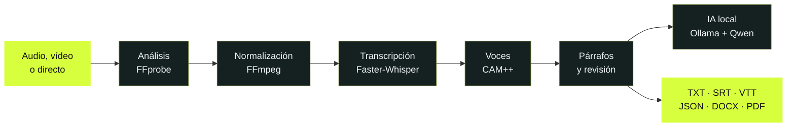

<div align="center">
  

  # Transcriptor

  ### Convierte audio y vídeo en texto útil, sin sacar tus conversaciones del ordenador.

  **Reproduce · transcribe · identifica hablantes · comprende · edita · exporta**

  [](https://github.com/NoelRDB/Transcriptor/actions/workflows/ci.yml)
  [](https://github.com/NoelRDB/Transcriptor/releases/latest)
  [](#instalación)
  [](#privacidad-por-diseño)
  [](https://tauri.app/)
  [](https://react.dev/)
  [](https://www.python.org/)
  [](LICENSE)

  <br>

  <a href="https://github.com/NoelRDB/Transcriptor/releases/latest">
    
  </a>

  <br>

  [Guía de instalación](docs/INSTALLATION.md) ·
  [Ver funciones](#qué-hace) ·
  [Documentación](#documentación) ·
  [Compilar](#desarrollo) ·
  [Colaborar](CONTRIBUTING.md)
</div>

<br>


> [!IMPORTANT]
> Para instalar Transcriptor no uses el botón verde **Code** ni descargues
> `Source code.zip`: esos archivos son para programadores. Pulsa **Descargar para
> Windows** y, dentro de `Assets`, elige el archivo que termina en
> `_x64-setup.exe`.

## ¿Qué hace?

Transcriptor reúne en una sola aplicación de escritorio todo el recorrido de una conversación: desde el archivo original hasta una transcripción editable, sincronizada y convertida en conocimiento.

| Área | Qué ofrece |
|---|---|
| 🎧 **Audio y vídeo** | Importación de MP3, WAV, M4A, AAC, FLAC, OGG, OPUS, MP4, MOV, MKV, AVI, WEBM y M4V. Reproductor integrado, velocidad, volumen, saltos y pantalla completa. |
| ✨ **Transcripción local** | Faster-Whisper con CUDA o CPU, timestamps por palabra, VAD, progreso real, resultados parciales, cancelación y recuperación. |
| 👥 **Hablantes** | Separación neuronal mediante CAM++, confianza por intervención y memoria local de voces cifrada con DPAPI. |
| 🧠 **Comprensión** | Resumen, puntos clave, capítulos, mapa conceptual y chat con referencias al instante exacto, mediante Ollama y Qwen en local. |
| ✍️ **Edición** | Texto sincronizado, búsqueda, deshacer/rehacer, autoseguimiento, párrafos contextuales y corrección manual de hablantes. |
| 📦 **Exportación** | TXT, SRT, WebVTT, CSV, JSON, DOCX, PDF y paquetes portables `.transcriptor`. |
| 🔒 **Privacidad** | Sin telemetría por defecto, sin nube obligatoria y sin registrar el contenido transcrito. |

## Del archivo al conocimiento, por partes

<table>
  <tr>
    <td width="50%">
      <h3>1. Importa o graba</h3>
      <p>Arrastra un audio o vídeo, usa el selector de archivos o abre <strong>En directo</strong> para capturar micrófono, audio del sistema o ambos.</p>
    </td>
    <td width="50%">
      <h3>2. El motor analiza el medio</h3>
      <p>FFprobe identifica duración, códecs y pistas. FFmpeg normaliza únicamente el audio necesario dentro de una carpeta temporal controlada.</p>
    </td>
  </tr>
  <tr>
    <td>
      <h3>3. Transcribe a máxima velocidad</h3>
      <p>El plan automático elige GPU, CPU, memoria, modelo y tamaño de lote según el equipo. El progreso representa audio realmente procesado.</p>
    </td>
    <td>
      <h3>4. Sincroniza cada palabra</h3>
      <p>La reproducción y la inferencia son independientes. Al reproducir, el fragmento activo se resalta y cualquier marca temporal permite saltar al instante exacto.</p>
    </td>
  </tr>
  <tr>
    <td>
      <h3>5. Distingue y recuerda voces</h3>
      <p>CAM++ genera huellas acústicas locales. Puedes nombrar perfiles, corregirlos y fusionar duplicados después de comparar su similitud real.</p>
    </td>
    <td>
      <h3>6. Comprende y exporta</h3>
      <p>Edita por párrafos, genera capítulos o puntos clave y exporta el resultado con timestamps, hablantes o anonimización.</p>
    </td>
  </tr>
</table>



## Transcripción sincronizada

- Resultados parciales mientras el motor continúa trabajando.
- Resaltado automático por fragmento y por palabra cuando existen timestamps precisos.
- Clic sobre cualquier intervención para mover el reproductor.
- Autodesplazamiento inteligente que se pausa mientras editas o navegas manualmente.
- Lista virtualizada para conversaciones largas.
- Párrafos contextuales que mantienen todas las palabras y sus tiempos originales.
- Diccionario personal para nombres propios y términos que quieras conservar.

## Hablantes y memoria de voz

La diarización incluida utiliza **CAM++ de 3D-Speaker** para producir embeddings acústicos normalizados de 192 dimensiones. No identifica civilmente a una persona: primero crea etiquetas como `Hablante 1`, y sólo utiliza un nombre cuando tú lo confirmas.

La memoria de voces:

- está desactivada hasta que el usuario la habilita expresamente;
- conserva embeddings cifrados con DPAPI, nunca recortes de audio;
- aprende únicamente de fragmentos suficientemente claros;
- permite renombrar, pausar, ajustar o eliminar cada perfil;
- compara perfiles duplicados antes de fusionarlos;
- conserva las mejores muestras y actualiza las transcripciones vinculadas al fusionar;
- reutiliza los nombres conocidos en conversaciones futuras.

> [!NOTE]
> La semejanza vocal es una ayuda organizativa, no una prueba de identidad. Ruido, micrófonos distintos, voces simultáneas o muy parecidas pueden requerir corrección manual.

[Leer cómo funciona la separación de hablantes →](docs/SPEAKER_DIARIZATION.md)

## Inteligencia local

El botón **Analizar** convierte una transcripción terminada en:

- resumen general;
- puntos clave enlazados a su momento exacto;
- capítulos;
- mapa conceptual;
- señales y extractores especializados;
- preguntas y respuestas sobre la conversación.

El modo **Profundo** usa Ollama y `qwen3.5:9b` en el ordenador. Divide las conversaciones largas en bloques, procesa el contexto de cada bloque y realiza una segunda síntesis global. El modo **Rápido** usa un análisis extractivo determinista cuando no quieres instalar un LLM.

```powershell
# Comprobar Ollama
ollama --version
ollama list

# Instalar el modelo recomendado, sólo cuando el usuario lo decida
ollama pull qwen3.5:9b
```

Ollama guarda normalmente sus modelos en `%USERPROFILE%\.ollama\models`. La descarga aproximada es de 6,6 GB y nunca debe iniciarse silenciosamente.

## Modos de calidad

| Modo | Motor | Recomendado para |
|---|---|---|
| ⚡ **Instantáneo** | Turbo por lotes | Borradores y archivos limpios a velocidad extrema. |
| ✨ **Profesional IA** | Turbo + revisión selectiva Large-v3 | Mejor equilibrio entre velocidad y precisión. |
| 🧠 **Máxima fidelidad** | Large-v3 completo | Audio difícil cuando prima la precisión sobre el tiempo. |

En el modo sencillo, Transcriptor analiza el hardware y configura automáticamente dispositivo, hilos, memoria, modelo y lote. El modo avanzado permite ajustar recursos, sensibilidad de hablantes, número máximo de voces y latencia del directo.

Las velocidades dependen del ruido, el modelo, la duración, la refrigeración y el hardware. La interfaz muestra rendimiento, VRAM, RAM, CPU, audio procesado y tiempo restante medidos durante el trabajo; no inventa porcentajes.

## Transcripción en directo

1. Pulsa **En directo**.
2. Elige micrófono, audio del sistema o mezcla.
3. Fija el idioma o utiliza detección automática.
4. Selecciona la latencia recomendada o una configuración avanzada.
5. Empieza a hablar.

Cada bloque PCM se guarda localmente antes de procesarse. El texto provisional aparece mientras hablas y, al detener, la aplicación finaliza un WAV reproducible y crea un proyecto normal para corregir, analizar o exportar.

## Privacidad por diseño

```text
Tus archivos ──► tu ordenador ──► tus proyectos
                     │
                     └── Nada se sube sin una acción explícita
```

- El audio, el vídeo, la transcripción y las huellas de voz se procesan localmente.
- La telemetría está desactivada por defecto.
- Los logs técnicos no contienen texto transcrito.
- Los diagnósticos ocultan rutas personales.
- Los perfiles de voz se cifran para la cuenta actual de Windows.
- Cada usuario y cada ordenador poseen su propia base de datos.
- El repositorio y los instaladores **no contienen proyectos, grabaciones, perfiles, modelos ni caché**.
- Desinstalar la aplicación no borra silenciosamente los proyectos personales.

[Consultar la política completa de datos locales →](docs/PRIVACY.md)

## Instalación

### Windows 10 y 11

**[Descargar la última versión para Windows →](https://github.com/NoelRDB/Transcriptor/releases/latest)**

1. En la sección **Assets**, descarga `Transcriptor_<versión>_x64-setup.exe`.
2. Abre el archivo descargado y sigue el asistente.
3. Inicia Transcriptor desde el menú Inicio o el acceso directo.
4. En la primera transcripción, confirma el modelo recomendado. La aplicación
   muestra su tamaño y lo instala dentro de tu cuenta de Windows.

El instalador ya incorpora la aplicación, el motor local de Python, FFmpeg,
FFprobe, el instalador de WebView2 y las bibliotecas necesarias para usar CPU o
una GPU NVIDIA compatible. **No hay que instalar Python, Node.js, Rust, CUDA ni
escribir comandos.**

Los modelos de reconocimiento se descargan desde **Ajustes → Modelos locales**
porque pueden ocupar varios gigabytes. Esta descarga forma parte de la
configuración guiada de la aplicación, requiere confirmación y se realiza una
sola vez. Después, la transcripción funciona localmente incluso sin conexión.

> [!TIP]
> El `.exe` es la descarga recomendada. El `.msi` está pensado para
> administradores. `checksums-SHA256.txt` sirve para comprobar la descarga y
> los archivos `Source code` no instalan la aplicación.

Mientras no haya firma de código, Windows SmartScreen puede mostrar “editor
desconocido”. Antes de continuar, comprueba que la dirección empieza por
`https://github.com/NoelRDB/Transcriptor/`. La
[guía para usuarios no técnicos](docs/INSTALLATION.md) explica cada pantalla y
cómo verificar el instalador.

### Formatos admitidos

| Audio | Vídeo |
|---|---|
| MP3, WAV, M4A, AAC, FLAC, OGG, OPUS | MP4, MOV, MKV, AVI, WEBM, M4V |

## Desarrollo

### Requisitos

- Windows 10 u 11 y WebView2.
- Node.js 18.20 o posterior.
- Rust estable con toolchain MSVC.
- Visual Studio Build Tools con C++.
- `uv`; Python 3.12 se gestiona desde el proyecto.

### Ejecutar localmente

```powershell
git clone https://github.com/NoelRDB/Transcriptor.git
cd Transcriptor

npm install
uv sync --project sidecar --extra dev
npm run sidecar:build
npm run tauri dev
```

La interfaz también se puede abrir con `npm run dev`, pero la transcripción real requiere Tauri y el sidecar.

### Comprobaciones

```powershell
# Todo el proyecto
npm run check

# Comandos individuales
npm run lint
npm run test
npm run build
npm run sidecar:lint
npm run sidecar:test
npm run release:verify
```

Las pruebas cubren timestamps, sincronización, exportadores, Unicode, persistencia, migraciones, cancelación, recuperación, cola, directo, diarización, perfiles de voz y análisis local.

## Crear instaladores

Prepara una compilación redistribuible LGPL de FFmpeg/FFprobe y ejecuta:

```powershell
.\scripts\stage-ffmpeg.ps1 -ArchivePath C:\ruta\ffmpeg-lgpl-shared.zip
npm run package:windows
```

Los paquetes NSIS/MSI se generan en `src-tauri\target\release\bundle`; los artefactos finales y sus sumas SHA-256 se copian a `release/`. Ambas ubicaciones están excluidas de Git.

[Leer la guía de empaquetado y licencias →](docs/PACKAGING.md)

## ¿Dónde se guardan los datos?

| Contenido | Ubicación predeterminada en Windows |
|---|---|
| Proyectos y configuración | `%LOCALAPPDATA%\TranscriptorData\transcriptor.sqlite3` |
| Grabaciones | `%LOCALAPPDATA%\TranscriptorData\recordings` |
| Modelos Whisper/CAM++ | `%LOCALAPPDATA%\TranscriptorData\models` |
| Modelos Ollama | `%USERPROFILE%\.ollama\models` |
| Paquetes importados | `%LOCALAPPDATA%\TranscriptorData\imports` |
| Logs técnicos | `%LOCALAPPDATA%\TranscriptorData\logs` |

Los archivos originales no se almacenan como binarios dentro de SQLite. El proyecto conserva su ruta y permite relocalizar el medio si se ha movido.
Las instalaciones de desarrollo anteriores que ya contengan datos en
`%LOCALAPPDATA%\Transcriptor` continúan utilizándolos sin moverlos.

## Arquitectura

```text
React + TypeScript
        │ mensajes y eventos JSONL tipados
        ▼
Tauri 2 / Rust ───── reproductor y acceso seguro al sistema
        │
        ▼
Sidecar Python
  ├─ FFmpeg / FFprobe
  ├─ Faster-Whisper
  ├─ CAM++ / ONNX Runtime
  ├─ Ollama / Qwen
  ├─ SQLite + migraciones
  └─ exportadores y diagnósticos
```

La interfaz nunca espera de forma síncrona a la extracción o inferencia. La cola persiste los trabajos, limita la concurrencia según los recursos y emite progreso estructurado al frontend.

## Estado y próximos pasos

- [x] Transcripción local progresiva.
- [x] Reproductor sincronizado y edición.
- [x] GPU CUDA con fallback explicado a CPU.
- [x] Directo con idioma y latencia configurables.
- [x] Separación neuronal y memoria cifrada de voces.
- [x] Comparación y fusión de perfiles duplicados.
- [x] Análisis local profundo y mapa conceptual.
- [x] Cola persistente y trabajos paralelos.
- [x] Exportadores y paquetes portables.
- [ ] Firma de código para Windows.
- [x] Primer instalador público para Windows.
- [ ] Forma de onda interactiva.
- [ ] Traducción local.
- [ ] Soporte validado para macOS y Linux.

Consulta el [historial de cambios](CHANGELOG.md) y las [limitaciones conocidas](docs/LIMITATIONS.md).

## Documentación

- [Instalación para usuarios de Windows](docs/INSTALLATION.md)
- [Arquitectura](docs/ARCHITECTURE.md)
- [Protocolo frontend–sidecar](docs/PROTOCOL.md)
- [Separación de hablantes](docs/SPEAKER_DIARIZATION.md)
- [Privacidad y datos locales](docs/PRIVACY.md)
- [Empaquetado para Windows](docs/PACKAGING.md)
- [Publicación de versiones](docs/RELEASING.md)
- [Limitaciones conocidas](docs/LIMITATIONS.md)
- [Avisos y licencias de terceros](docs/THIRD_PARTY_NOTICES.md)
- [Política de seguridad](SECURITY.md)

## Colaborar

Los informes de errores y pull requests son bienvenidos. Antes de contribuir:

1. Lee [CONTRIBUTING.md](CONTRIBUTING.md).
2. No adjuntes grabaciones ni transcripciones personales.
3. Usa medios pequeños, generados o legalmente reutilizables para las pruebas.
4. Ejecuta `npm run check`.
5. Explica el efecto sobre privacidad, rendimiento y empaquetado.

## Licencia

El código propio de Transcriptor se publica bajo [MIT](LICENSE). FFmpeg, Faster-Whisper, CTranslate2, CAM++, modelos y demás componentes conservan sus respectivas licencias y condiciones. Consulta [THIRD_PARTY_NOTICES.md](docs/THIRD_PARTY_NOTICES.md) antes de redistribuir binarios.

<div align="center">
  <br>
  <strong>Hecho para que tus conversaciones se conviertan en conocimiento sin dejar de ser tuyas.</strong>
  <br><br>
  <a href="https://github.com/NoelRDB/Transcriptor/issues">Reportar un problema</a>
  ·
  <a href="https://github.com/NoelRDB/Transcriptor/discussions">Proponer una idea</a>
</div>
