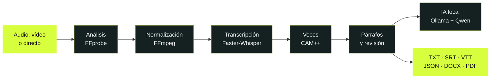

<div align="center">
  

  # Transcriptor

  ### Convierte audio y vídeo en texto útil, sin sacar tus conversaciones del ordenador.

  **Reproduce · transcribe · identifica hablantes · comprende · edita · exporta**

  [](https://github.com/NoelRDB/Transcriptor/actions/workflows/ci.yml)
  [](https://github.com/NoelRDB/Transcriptor/releases/tag/v0.1.1)
  [](#instalación)
  [](#privacidad-por-diseño)
  [](https://tauri.app/)
  [](https://react.dev/)
  [](https://www.python.org/)
  [](LICENSE)

  <br>

  <a href="https://github.com/NoelRDB/Transcriptor/releases/download/v0.1.1/Transcriptor_0.1.1_x64-setup.exe">
    
  </a>

  <br>

  [Guía de instalación](docs/INSTALLATION.md) ·
  [Ver funciones](#qué-hace) ·
  [Documentación](#documentación) ·
  [Compilar](#desarrollo) ·
  [Colaborar](CONTRIBUTING.md)
</div>

<br>



> [!IMPORTANT]
> Para instalar Transcriptor no uses el botón verde **Code** ni descargues
> `Source code.zip`: esos archivos son para programadores. Pulsa **Descargar para
> Windows** y comenzará directamente la descarga del instalador `.exe`.

## Novedades de v0.1.1

Esta candidata concentra el trabajo de estabilidad y rendimiento de la primera
versión pública. Mantiene el procesamiento privado de `v0.1.0`, pero reduce las
esperas visibles y hace más fiable la preparación de los motores locales.

| Mejora | Resultado para el usuario |
|---|---|
| ⚡ **Inicio más rápido** | Los proyectos recientes aparecen desde la caché mientras el motor termina de arrancar. |
| 🚀 **Transcripción optimizada** | CUDA, los modelos y las comprobaciones costosas se reutilizan durante la sesión en lugar de prepararse repetidamente. |
| 📂 **Acceso directo al archivo** | Cada proyecto reciente incluye **Mostrar en carpeta** para localizar inmediatamente su audio o vídeo. |
| 🎙️ **Grabación más ágil** | Micrófonos y fuentes de audio se detectan en paralelo y la ventana deja de esperar comprobaciones independientes. |
| 👥 **Voces listas de verdad** | CAM++ se valida desde el runtime empaquetado y Ajustes distingue entre instalado, comprobando y pendiente. |
| 🧭 **Ajustes estables** | Hardware, modelos, CUDA e IA local mantienen estados separados, sin refrescar toda la pantalla constantemente. |
| 🗃️ **Proyectos grandes** | Las palabras de todos los segmentos se cargan en una sola consulta y el texto ASCII evita reparaciones Unicode innecesarias. |
| 🛡️ **Instalador auditable** | El paquete público incluye CPU, FFmpeg y avisos legales, pero deja CUDA como descarga opcional con consentimiento. |

En el equipo de desarrollo, el motor instalado estuvo disponible en torno a
**1,05 s** y un proyecto de 1.107 segmentos pasó de aproximadamente **727 ms a
113 ms** al abrirse. Son mediciones orientativas: el rendimiento final depende
del disco, CPU, GPU, modelo y características del audio.

## ¿Qué hace?

Transcriptor reúne en una sola aplicación de escritorio todo el recorrido de una conversación: desde el archivo original hasta una transcripción editable, sincronizada y convertida en conocimiento.

| Área | Qué ofrece |
|---|---|
| 🎧 **Audio y vídeo** | Importación de MP3, WAV, M4A, AAC, FLAC, OGG, OPUS, MP4, MOV, MKV, AVI, WEBM y M4V. Reproductor integrado, velocidad, volumen, saltos y pantalla completa. |
| ✨ **Transcripción local** | Faster-Whisper con CUDA o CPU, timestamps por palabra, VAD, progreso real, resultados parciales, cancelación y recuperación. |
| 👥 **Hablantes** | Separación neuronal mediante CAM++, confianza por intervención y memoria local de voces cifrada con DPAPI. |
| 🧠 **Comprensión** | Resumen, puntos clave, capítulos, mapa conceptual y chat con referencias al instante exacto, mediante Ollama y Qwen en local. |
| ✍️ **Edición** | Texto sincronizado, búsqueda, deshacer/rehacer, autoseguimiento, párrafos contextuales y corrección manual de hablantes. |
| 📦 **Exportación** | TXT, SRT, WebVTT, CSV, JSON, DOCX, PDF y paquetes portables `.transcriptor`. |
| 🔒 **Privacidad** | Sin telemetría por defecto, sin nube obligatoria y sin registrar el contenido transcrito. |

## Del archivo al conocimiento, por partes

<table>
  <tr>
    <td width="50%">
      <h3>1. Importa o graba</h3>
      <p>Arrastra un audio o vídeo, usa el selector de archivos o abre <strong>En directo</strong> para capturar micrófono, audio del sistema o ambos.</p>
    </td>
    <td width="50%">
      <h3>2. El motor analiza el medio</h3>
      <p>FFprobe identifica duración, códecs y pistas. FFmpeg normaliza únicamente el audio necesario dentro de una carpeta temporal controlada.</p>
    </td>
  </tr>
  <tr>
    <td>
      <h3>3. Transcribe a máxima velocidad</h3>
      <p>El plan automático elige GPU, CPU, memoria, modelo y tamaño de lote según el equipo. El progreso representa audio realmente procesado.</p>
    </td>
    <td>
      <h3>4. Sincroniza cada palabra</h3>
      <p>La reproducción y la inferencia son independientes. Al reproducir, el fragmento activo se resalta y cualquier marca temporal permite saltar al instante exacto.</p>
    </td>
  </tr>
  <tr>
    <td>
      <h3>5. Distingue y recuerda voces</h3>
      <p>CAM++ genera huellas acústicas locales. Puedes nombrar perfiles, corregirlos y fusionar duplicados después de comparar su similitud real.</p>
    </td>
    <td>
      <h3>6. Comprende y exporta</h3>
      <p>Edita por párrafos, genera capítulos o puntos clave y exporta el resultado con timestamps, hablantes o anonimización.</p>
    </td>
  </tr>
</table>



## Transcripción sincronizada

- Resultados parciales mientras el motor continúa trabajando.
- Resaltado automático por fragmento y por palabra cuando existen timestamps precisos.
- Clic sobre cualquier intervención para mover el reproductor.
- Autodesplazamiento inteligente que se pausa mientras editas o navegas manualmente.
- Lista virtualizada para conversaciones largas.
- Párrafos contextuales que mantienen todas las palabras y sus tiempos originales.
- Diccionario personal para nombres propios y términos que quieras conservar.

## Hablantes y memoria de voz

La diarización incluida utiliza **CAM++ de 3D-Speaker** para producir embeddings acústicos normalizados de 192 dimensiones. No identifica civilmente a una persona: primero crea etiquetas como `Hablante 1`, y sólo utiliza un nombre cuando tú lo confirmas.

La memoria de voces:

- está desactivada hasta que el usuario la habilita expresamente;
- conserva embeddings cifrados con DPAPI, nunca recortes de audio;
- aprende únicamente de fragmentos suficientemente claros;
- permite renombrar, pausar, ajustar o eliminar cada perfil;
- compara perfiles duplicados antes de fusionarlos;
- conserva las mejores muestras y actualiza las transcripciones vinculadas al fusionar;
- reutiliza los nombres conocidos en conversaciones futuras.

> [!NOTE]
> La semejanza vocal es una ayuda organizativa, no una prueba de identidad. Ruido, micrófonos distintos, voces simultáneas o muy parecidas pueden requerir corrección manual.

[Leer cómo funciona la separación de hablantes →](docs/SPEAKER_DIARIZATION.md)

## Inteligencia local

El botón **Analizar** convierte una transcripción terminada en:

- resumen general;
- puntos clave enlazados a su momento exacto;
- capítulos;
- mapa conceptual;
- señales y extractores especializados;
- preguntas y respuestas sobre la conversación.

El modo **Profundo** usa Ollama y `qwen3.5:9b` en el ordenador. Divide las conversaciones largas en bloques, procesa el contexto de cada bloque y realiza una segunda síntesis global. El modo **Rápido** usa un análisis extractivo determinista cuando no quieres instalar un LLM.

```powershell
# Comprobar Ollama
ollama --version
ollama list

# Instalar el modelo recomendado, sólo cuando el usuario lo decida
ollama pull qwen3.5:9b
```

Ollama guarda normalmente sus modelos en `%USERPROFILE%\.ollama\models`. La descarga aproximada es de 6,6 GB y nunca debe iniciarse silenciosamente.

## Modos de calidad

| Modo | Motor | Recomendado para |
|---|---|---|
| ⚡ **Instantáneo** | Turbo por lotes | Borradores y archivos limpios a velocidad extrema. |
| ✨ **Profesional IA** | Turbo + revisión selectiva Large-v3 | Mejor equilibrio entre velocidad y precisión. |
| 🧠 **Máxima fidelidad** | Large-v3 completo | Audio difícil cuando prima la precisión sobre el tiempo. |

En el modo sencillo, Transcriptor analiza el hardware y configura automáticamente dispositivo, hilos, memoria, modelo y lote. El modo avanzado permite ajustar recursos, sensibilidad de hablantes y número máximo de voces para la transcripción posterior.

Las velocidades dependen del ruido, el modelo, la duración, la refrigeración y el hardware. La interfaz muestra rendimiento, VRAM, RAM, CPU, audio procesado y tiempo restante medidos durante el trabajo; no inventa porcentajes.

## Grabadora local

1. Pulsa **Grabar**.
2. Elige micrófono, audio del sistema o mezcla.
3. Fija el idioma que se utilizará después o deja la detección automática.
4. Graba, pausa y reanuda cuando lo necesites.
5. Finaliza para abrir el WAV como un proyecto normal.

La grabadora no carga Whisper, no transcribe y no separa hablantes durante la captura. Muestra una onda reactiva al nivel de audio y guarda cada bloque PCM localmente. Al detener, finaliza un WAV reproducible; después basta con pulsar **Transcribir** para ejecutar una sola vez la transcripción, la diarización y el reconocimiento de perfiles de voz con todo el contexto disponible.

## Privacidad por diseño

```text
Tus archivos ──► tu ordenador ──► tus proyectos
                     │
                     └── Nada se sube sin una acción explícita
```

- El audio, el vídeo, la transcripción y las huellas de voz se procesan localmente.
- La telemetría está desactivada por defecto.
- Los logs técnicos no contienen texto transcrito.
- Los diagnósticos ocultan rutas personales.
- Los perfiles de voz se cifran para la cuenta actual de Windows.
- Cada usuario y cada ordenador poseen su propia base de datos.
- El repositorio y los instaladores **no contienen proyectos, grabaciones,
  perfiles, modelos ni caché del usuario**.
- La Release heredada `v0.1.0` sí incorpora bibliotecas CUDA de NVIDIA;
  `v0.1.1`, las compilaciones actuales de `master` y las versiones posteriores
  las excluyen y sólo ofrecen descargarlas con consentimiento.
- Desinstalar la aplicación no borra silenciosamente los proyectos personales.

[Consultar la política completa de datos locales →](docs/PRIVACY.md)

## Code signing policy (política de firma)

La versión pública `v0.1.0` y la candidata `v0.1.1` se distribuyen **sin firma
de código**. La solicitud para el programa gratuito de SignPath Foundation
está pendiente de evaluación: SignPath no ha aprobado todavía el proyecto y
ninguna versión de Transcriptor afirma estar firmada por SignPath Foundation.
Además, `v0.1.0` incluye el runtime propietario CUDA dentro de sus instaladores
heredados, por lo que **no es candidata a recibir una firma de SignPath**.

Si la solicitud se aprueba, sólo se firmarán artefactos reproducibles obtenidos
del repositorio oficial mediante el proceso documentado, después de pasar las
pruebas, la revisión de licencias y una aprobación manual de la versión. En ese
momento se incorporará a la página de descarga la atribución exigida:
“Free code signing provided by
[SignPath.io](https://signpath.io/), certificate by
[SignPath Foundation](https://signpath.org/)”.

El mantenedor actual, [NoelRDB](https://github.com/NoelRDB), ejerce los roles de
autor, revisor y aprobador. Consulta la
[Code signing policy completa](docs/CODE_SIGNING_POLICY.md) para ver el estado
real, el alcance, los controles y cómo se identificará una versión firmada.

## Instalación

### Windows 10 y 11

**[Descargar directamente Transcriptor v0.1.1 para Windows →](https://github.com/NoelRDB/Transcriptor/releases/download/v0.1.1/Transcriptor_0.1.1_x64-setup.exe)**

[Ver la página de la Release, sus sumas SHA-256 y el instalador MSI](https://github.com/NoelRDB/Transcriptor/releases/tag/v0.1.1).

1. En la sección **Assets**, descarga `Transcriptor_<versión>_x64-setup.exe`.
2. Abre el archivo descargado y sigue el asistente.
3. Inicia Transcriptor desde el menú Inicio o el acceso directo.
4. En la primera transcripción, confirma el modelo recomendado. La aplicación
   muestra su tamaño y lo instala dentro de tu cuenta de Windows.

`v0.1.1` es una candidata pública de evaluación y no tiene firma Authenticode.
Verifica `checksums-SHA256.txt` antes de ejecutarla.
En esta candidata tampoco están firmados individualmente `Transcriptor.exe`,
el sidecar ni los DLL internos.

Cada asset final publicado desde GitHub Actions incorpora además una
atestación Sigstore gratuita de procedencia. Con GitHub CLI puede verificarse
mediante `gh attestation verify <archivo> -R NoelRDB/Transcriptor`. Esto
demuestra el repositorio y workflow que produjeron ese hash, pero no sustituye
Authenticode, el editor mostrado por Windows ni la reputación de SmartScreen.

Todos los instaladores incorporan la aplicación, el motor local de Python,
FFmpeg, FFprobe y todo lo necesario para transcribir con CPU. También necesitan
el runtime **Microsoft Edge WebView2**, que Windows 10/11 normalmente ya
incluye. Para mantener el instalador íntegramente auditable, no contiene ni
descarga el bootstrapper propietario. En el caso poco habitual de que WebView2
falte, instálalo primero desde la
[página oficial de Microsoft](https://developer.microsoft.com/microsoft-edge/webview2/).
**No hay que instalar Python, Node.js, Rust ni escribir comandos.**

El motor CPU incluido usa CTranslate2 4.8.1 y sus dependencias fijadas por
`uv.lock`. El instalador conserva el inventario y las licencias exactas del
runtime Python, incluido Intel OpenMP, y la publicación verifica que no se
empaqueten bibliotecas CUDA. La aceleración NVIDIA se prepara aparte y sólo
después del consentimiento del usuario.

> [!IMPORTANT]
> La Release heredada `v0.1.0`, que continúa descargable, incluye cuBLAS y cuDNN
> dentro del instalador y no está firmada. `v0.1.1` y las compilaciones actuales
> de `master` ya no incluyen esas bibliotecas propietarias.
> `v0.1.0` no se presentará retroactivamente a SignPath.

En las compilaciones posteriores a `v0.1.0`, si se detecta una GPU NVIDIA
compatible y quieres acelerarla, el asistente **Prepara la IA local** ofrece la
tarjeta **Aceleración NVIDIA CUDA**. Antes de descargar aproximadamente
1,27 GiB muestra origen, tamaño y 6 GiB de espacio temporal necesario; requiere una confirmación
explícita, enseña progreso real y permite cancelar o reintentar. Cada archivo se
valida con un SHA-256 fijado antes de activarlo en la carpeta privada de la
aplicación. Rechazar esa descarga no bloquea Transcriptor: el motor utiliza CPU
automáticamente.

Los modelos de reconocimiento se descargan desde **Ajustes → Modelos locales**
porque pueden ocupar varios gigabytes. Esta descarga forma parte de la
configuración guiada de la aplicación, requiere confirmación y se realiza una
sola vez. Después, la transcripción funciona localmente incluso sin conexión.

> [!TIP]
> El `.exe` es la descarga recomendada. El `.msi` está pensado para
> administradores. `checksums-SHA256.txt` sirve para comprobar la descarga y
> los archivos `Source code` no instalan la aplicación.

`v0.1.0` y `v0.1.1` no están firmadas, por lo que Windows SmartScreen puede
mostrar “editor desconocido”. Una firma futura tampoco garantiza que
SmartScreen deje de advertir inmediatamente: Windows construye la reputación
con el tiempo. Antes de continuar, comprueba que la dirección empieza por
`https://github.com/NoelRDB/Transcriptor/`. La
[guía para usuarios no técnicos](docs/INSTALLATION.md) explica cada pantalla y
cómo verificar el instalador.

### Formatos admitidos

| Audio | Vídeo |
|---|---|
| MP3, WAV, M4A, AAC, FLAC, OGG, OPUS | MP4, MOV, MKV, AVI, WEBM, M4V |

## Desarrollo

### Requisitos

- Windows 10 u 11 y
  [Microsoft Edge WebView2](https://developer.microsoft.com/microsoft-edge/webview2/)
  instalado.
- Node.js 18.20 o posterior.
- Rust estable con toolchain MSVC.
- Visual Studio Build Tools con C++.
- `uv`; Python 3.12 se gestiona desde el proyecto.

### Ejecutar localmente

```powershell
git clone https://github.com/NoelRDB/Transcriptor.git
cd Transcriptor

npm install
uv sync --project sidecar --extra dev
npm run sidecar:build
npm run tauri dev
```

La interfaz también se puede abrir con `npm run dev`, pero la transcripción real requiere Tauri y el sidecar.

### Comprobaciones

```powershell
# Todo el proyecto
npm run check

# Comandos individuales
npm run lint
npm run test
npm run build
npm run sidecar:lint
npm run sidecar:test
npm run release:verify
```

Las pruebas cubren timestamps, sincronización, exportadores, Unicode, persistencia, migraciones, cancelación, recuperación, cola, directo, diarización, perfiles de voz y análisis local.

## Crear instaladores

Prepara el ZIP LGPL construido desde la fuente fijada (consulta la guía de
empaquetado) y ejecuta:

```powershell
.\scripts\stage-ffmpeg.ps1 `
  -ArchivePath C:\ruta\ffmpeg-runtime-windows-x64.zip
npm run package:windows
```

Los paquetes NSIS/MSI se generan en `src-tauri\target\release\bundle`; los
artefactos finales, sus sumas SHA-256, los avisos y el código fuente
correspondiente exacto de FFmpeg se preparan para la Release. Estas ubicaciones
están excluidas de Git.

[Leer la guía de empaquetado y licencias →](docs/PACKAGING.md)

## ¿Dónde se guardan los datos?

| Contenido | Ubicación predeterminada en Windows |
|---|---|
| Proyectos y configuración | `%LOCALAPPDATA%\TranscriptorData\transcriptor.sqlite3` |
| Grabaciones | `%LOCALAPPDATA%\TranscriptorData\recordings` |
| Modelos Whisper/CAM++ | `%LOCALAPPDATA%\TranscriptorData\models` |
| Modelos Ollama | `%USERPROFILE%\.ollama\models` |
| Paquetes importados | `%LOCALAPPDATA%\TranscriptorData\imports` |
| Logs técnicos | `%LOCALAPPDATA%\TranscriptorData\logs` |

Los archivos originales no se almacenan como binarios dentro de SQLite. El proyecto conserva su ruta y permite relocalizar el medio si se ha movido.
Las instalaciones de desarrollo anteriores que ya contengan datos en
`%LOCALAPPDATA%\Transcriptor` continúan utilizándolos sin moverlos.

## Arquitectura

```text
React + TypeScript
        │ mensajes y eventos JSONL tipados
        ▼
Tauri 2 / Rust ───── reproductor y acceso seguro al sistema
        │
        ▼
Sidecar Python
  ├─ FFmpeg / FFprobe
  ├─ Faster-Whisper
  ├─ CAM++ / ONNX Runtime
  ├─ Ollama / Qwen
  ├─ SQLite + migraciones
  └─ exportadores y diagnósticos
```

La interfaz nunca espera de forma síncrona a la extracción o inferencia. La cola persiste los trabajos, limita la concurrencia según los recursos y emite progreso estructurado al frontend.

## Estado y próximos pasos

- [x] Transcripción local progresiva.
- [x] Reproductor sincronizado y edición.
- [x] GPU CUDA con fallback explicado a CPU.
- [x] Directo con idioma y latencia configurables.
- [x] Separación neuronal y memoria cifrada de voces.
- [x] Comparación y fusión de perfiles duplicados.
- [x] Análisis local profundo y mapa conceptual.
- [x] Cola persistente y trabajos paralelos.
- [x] Exportadores y paquetes portables.
- [ ] Aprobación e integración de firma de código para Windows.
- [x] Primer instalador público para Windows.
- [ ] Forma de onda interactiva.
- [ ] Traducción local.
- [ ] Soporte validado para macOS y Linux.

Consulta el [historial de cambios](CHANGELOG.md) y las [limitaciones conocidas](docs/LIMITATIONS.md).

## Documentación

- [Instalación para usuarios de Windows](docs/INSTALLATION.md)
- [Arquitectura](docs/ARCHITECTURE.md)
- [Protocolo frontend–sidecar](docs/PROTOCOL.md)
- [Separación de hablantes](docs/SPEAKER_DIARIZATION.md)
- [Privacidad y datos locales](docs/PRIVACY.md)
- [Code signing policy](docs/CODE_SIGNING_POLICY.md)
- [Empaquetado para Windows](docs/PACKAGING.md)
- [Publicación de versiones](docs/RELEASING.md)
- [Limitaciones conocidas](docs/LIMITATIONS.md)
- [Avisos y licencias de terceros](docs/THIRD_PARTY_NOTICES.md)
- [Política de seguridad](SECURITY.md)

## Colaborar

Los informes de errores y pull requests son bienvenidos. Antes de contribuir:

1. Lee [CONTRIBUTING.md](CONTRIBUTING.md).
2. No adjuntes grabaciones ni transcripciones personales.
3. Usa medios pequeños, generados o legalmente reutilizables para las pruebas.
4. Ejecuta `npm run check`.
5. Explica el efecto sobre privacidad, rendimiento y empaquetado.

## Licencia

El código propio de Transcriptor se publica bajo [MIT](LICENSE). FFmpeg, Faster-Whisper, CTranslate2, CAM++, modelos y demás componentes conservan sus respectivas licencias y condiciones. Consulta [THIRD_PARTY_NOTICES.md](docs/THIRD_PARTY_NOTICES.md) antes de redistribuir binarios.

<div align="center">
  <br>
  <strong>Hecho para que tus conversaciones se conviertan en conocimiento sin dejar de ser tuyas.</strong>
  <br><br>
  <a href="https://github.com/NoelRDB/Transcriptor/issues">Reportar un problema</a>
  ·
  <a href="https://github.com/NoelRDB/Transcriptor/discussions">Proponer una idea</a>
</div>
